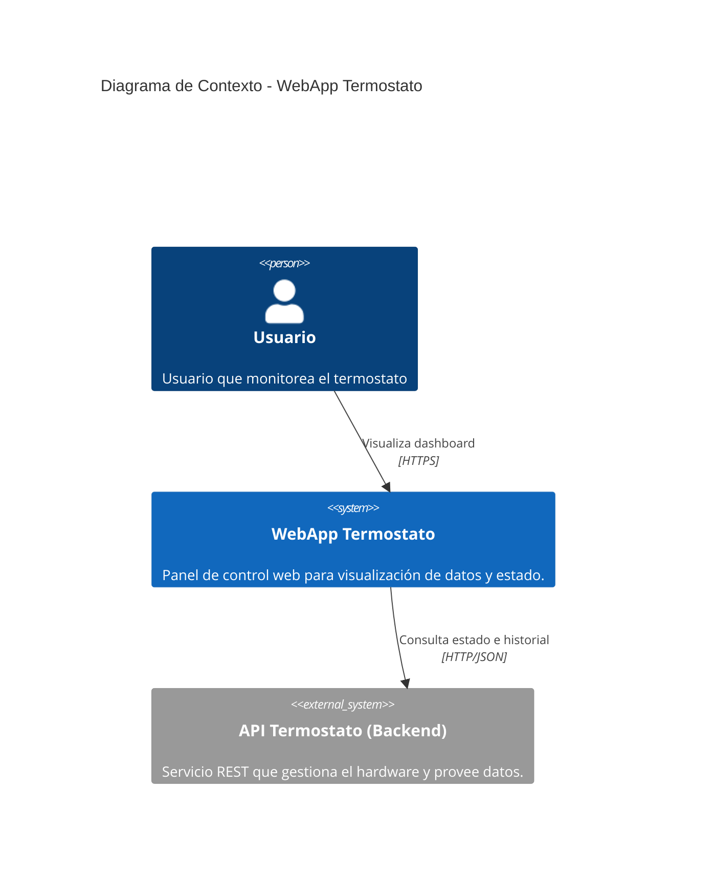
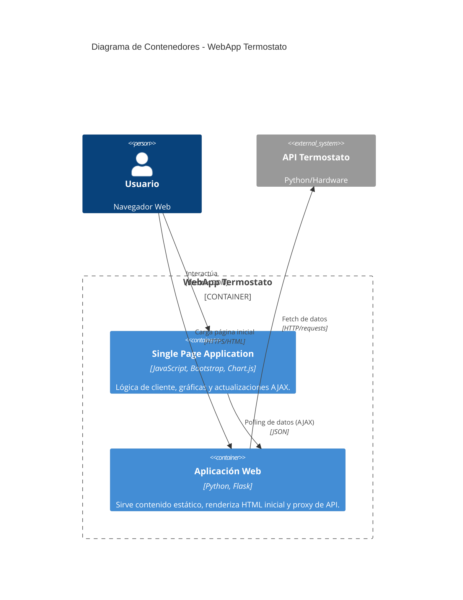
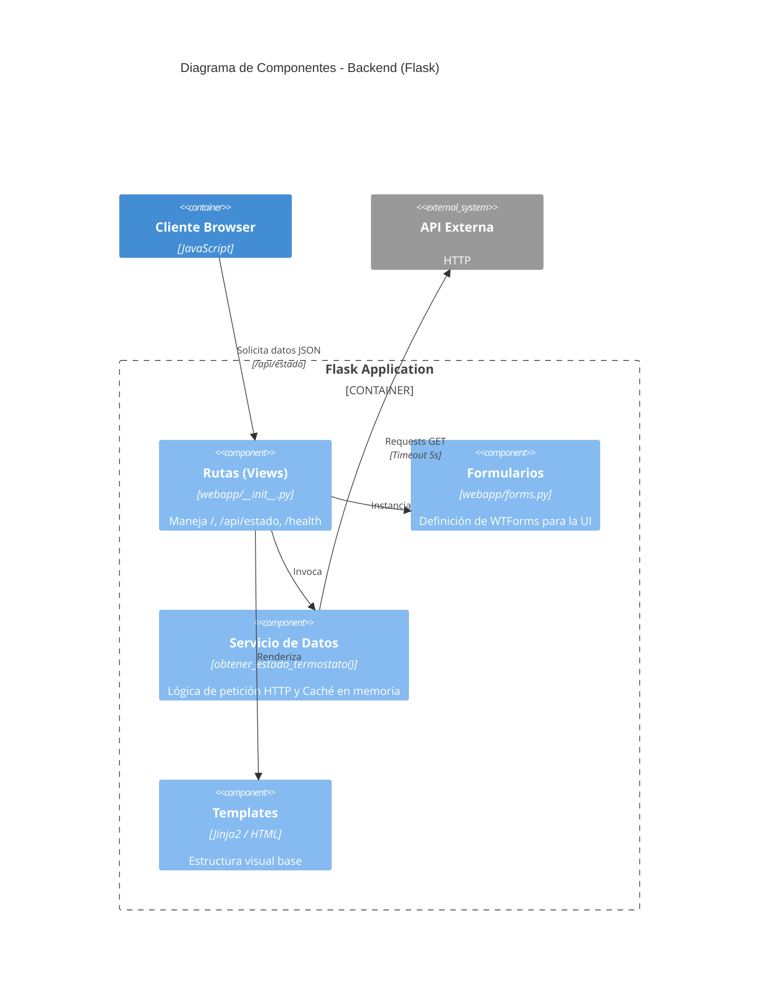
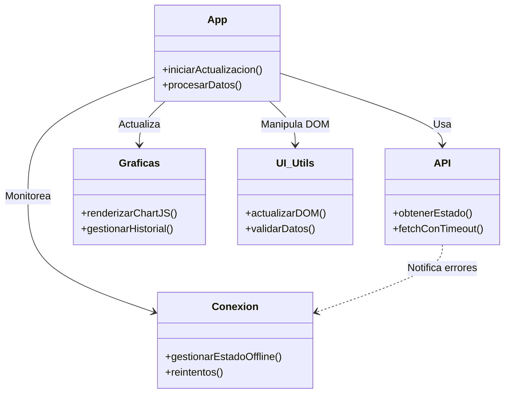

# Arquitectura del Sistema - Modelo C4

Este documento describe la arquitectura de la aplicación **WebApp Termostato** utilizando el modelo C4.

## 1. Diagrama de Contexto (Nivel 1)

Muestra el sistema en el contexto de su entorno y sus interacciones con sistemas externos.

### Descripción
*   **Usuario**: Accede a la aplicación a través de un navegador web.
*   **WebApp Termostato**: El proyecto actual. Sirve la interfaz gráfica y actúa como proxy/cliente de los datos.
*   **API Termostato**: Sistema externo (puerto 5050) que interactúa con los sensores físicos.

---

## 2. Diagrama de Contenedores (Nivel 2)

Muestra las aplicaciones y almacenes de datos de alto nivel.

### Descripción
*   **Single Page Application (JS)**: Ejecutada en el navegador del usuario. Gestiona la actualización en tiempo real (polling cada 10s), gráficas y alertas visuales sin recargar la página.
*   **Aplicación Web (Flask)**:
    *   Sirve los assets estáticos y templates Jinja2.
    *   Actúa como **BFF (Backend for Frontend)**: Expone endpoints locales (`/api/estado`) que hacen de puente hacia la API real, manejando timeouts y caché de emergencia.

---

## 3. Diagrama de Componentes (Nivel 3)

Detalla la estructura interna de la aplicación Flask y la organización modular del JavaScript.

### 3.1 Componentes del Servidor (Flask)

### 3.2 Componentes del Cliente (JavaScript)

La lógica de cliente ha sido refactorizada en módulos (ES5/ES6 pattern) para mantenibilidad.

## Decisiones de Diseño Clave

1.  **Caché en Memoria (Fallback)**:
    *   El servidor Flask mantiene una variable global `ultima_respuesta_valida`.
    *   Si la API externa falla (timeout o error 500), Flask sirve los últimos datos conocidos con un flag `from_cache=True`.
    *   Esto permite que el frontend detecte la desconexión pero siga mostrando datos útiles.

2.  **Polling vs WebSockets**:
    *   Se optó por **Polling (AJAX)** cada 10 segundos en lugar de WebSockets por simplicidad y robustez ante desconexiones inestables.
    *   El módulo `api.js` implementa una lógica de "Backoff exponencial" para reintentos si la conexión falla.

3.  **Validación en Capas**:
    *   El Frontend (`validacion.js`) valida rangos y tipos de datos antes de renderizar para evitar romper las gráficas con datos corruptos.
