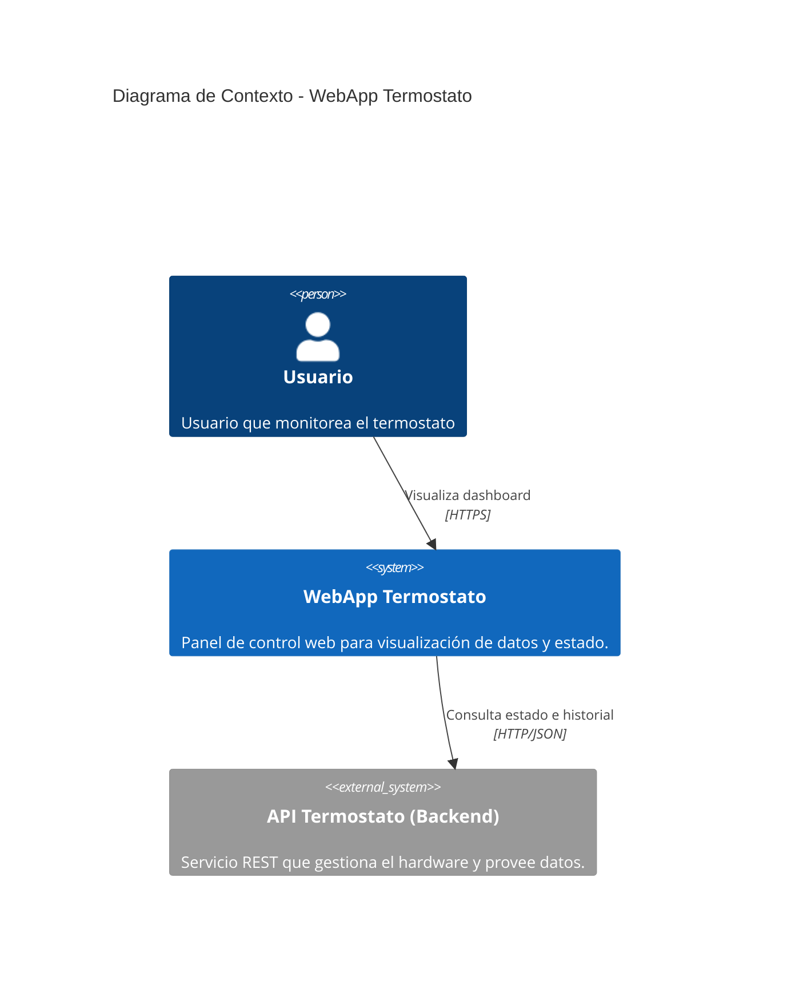
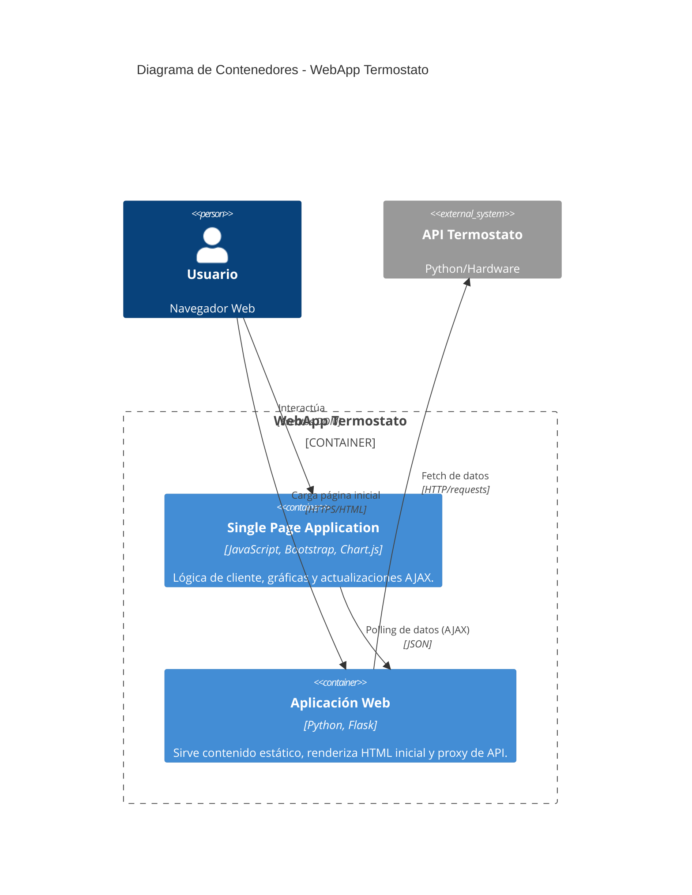
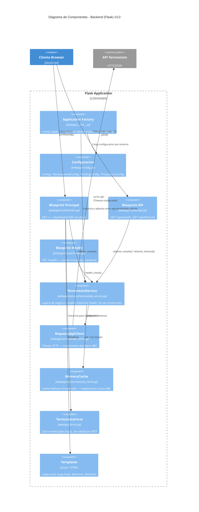
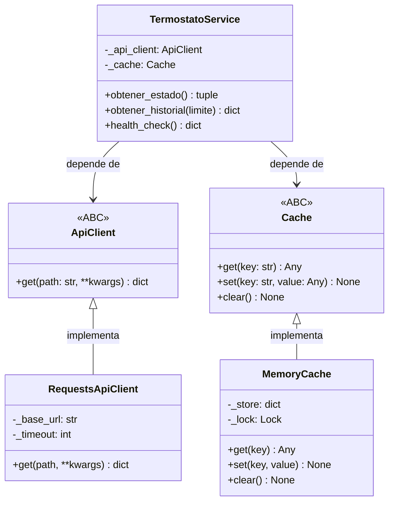
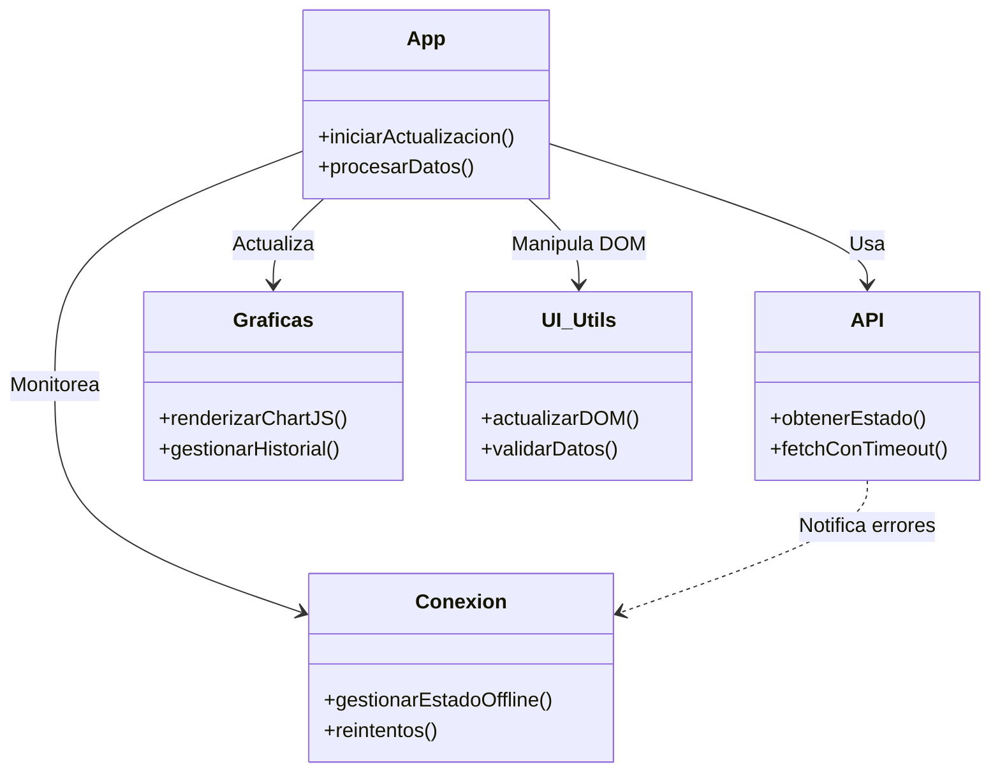

# Arquitectura del Sistema - Modelo C4

Este documento describe la arquitectura de la aplicación **WebApp Termostato** utilizando el modelo C4.

## 1. Diagrama de Contexto (Nivel 1)

Muestra el sistema en el contexto de su entorno y sus interacciones con sistemas externos.

### Descripción
*   **Usuario**: Accede a la aplicación a través de un navegador web.
*   **WebApp Termostato**: El proyecto actual. Sirve la interfaz gráfica y actúa como proxy/cliente de los datos.
*   **API Termostato**: Sistema externo (puerto 5050) que interactúa con los sensores físicos.

---

## 2. Diagrama de Contenedores (Nivel 2)

Muestra las aplicaciones y almacenes de datos de alto nivel.

### Descripción
*   **Single Page Application (JS)**: Ejecutada en el navegador del usuario. Gestiona la actualización en tiempo real (polling cada 10s), gráficas y alertas visuales sin recargar la página.
*   **Aplicación Web (Flask)**:
    *   Sirve los assets estáticos y templates Jinja2.
    *   Actúa como **BFF (Backend for Frontend)**: Expone endpoints locales (`/api/estado`) que hacen de puente hacia la API real, manejando timeouts y caché de emergencia.

---

## 3. Diagrama de Componentes (Nivel 3)

Detalla la estructura interna de la aplicación Flask y la organización modular del JavaScript.

### 3.1 Componentes del Servidor (Flask)

Arquitectura por capas implementada en **US-001** (Application Factory + DIP).

### 3.2 Diagrama de Clases — Inyeccion de Dependencias

Muestra las interfaces (ABCs) y sus implementaciones concretas que permiten el principio de inversion de dependencias (DIP).

### 3.3 Componentes del Cliente (JavaScript)

La lógica de cliente ha sido refactorizada en módulos (ES5/ES6 pattern) para mantenibilidad.

## Decisiones de Diseño Clave

1.  **Caché en Memoria como Fallback (MemoryCache)**:
    *   `MemoryCache` (en `webapp/cache/memory_cache.py`) almacena la última respuesta válida bajo la clave `'estado'` como tupla `(datos, timestamp)`.
    *   Implementa la interfaz `Cache` (ABC), permitiendo sustituirla por Redis u otro backend sin modificar `TermostatoService`.
    *   Usa `threading.Lock` para garantizar seguridad en entornos multi-hilo (Gunicorn).
    *   El servicio **siempre** intenta obtener datos frescos del backend; el caché solo actúa si la API lanza `RequestException` (fallback, no cache-first).
    *   El flag `from_cache=True` en la respuesta JSON permite que el frontend detecte la desconexión pero siga mostrando datos útiles.

2.  **Inversión de Dependencias (DIP)**:
    *   `TermostatoService` depende de las abstracciones `ApiClient` y `Cache`, no de implementaciones concretas.
    *   Esto permite inyectar mocks en tests sin `@patch` y facilita cambiar la implementación del cliente HTTP o del caché de forma independiente (ver ADR-001, ADR-002).

3.  **Application Factory**:
    *   `create_app(config_name)` en `webapp/__init__.py` elimina el estado global a nivel de módulo.
    *   Permite instanciar múltiples apps con configuraciones distintas (`'testing'`, `'development'`, `'production'`), esencial para tests aislados.

4.  **Polling vs WebSockets**:
    *   Se optó por **Polling (AJAX)** cada 10 segundos en lugar de WebSockets por simplicidad y robustez ante desconexiones inestables.
    *   El módulo `api.js` implementa una lógica de backoff exponencial para reintentos si la conexión falla.

5.  **Validación en Capas**:
    *   El frontend (`validacion.js`) valida rangos y tipos de datos antes de renderizar para evitar romper las gráficas con datos corruptos.

---

Fecha creación: 28/01/2026
Última actualización: 2026-02-24 (US-001 — Arquitectura por capas)
