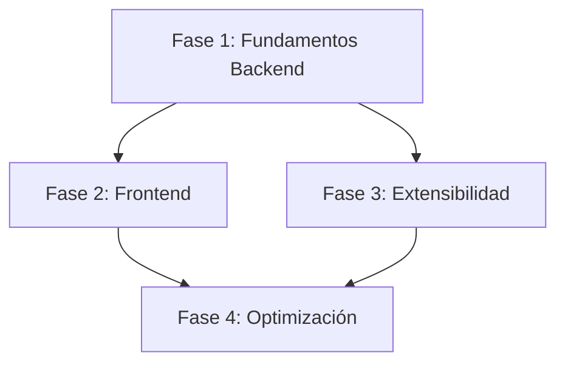

# Plan de Mantenimiento y Refactorización
## Proyecto: webapp_termostato

> **Fecha de Inicio:** 2026-02-14
> **Versión Actual:** 3.0.0
> **Versión Objetivo:** 3.0.0
> **Estado:** ✅ Fase 1 y Fase 2 (parcial) completadas

---

## 📊 Resumen Ejecutivo

Este documento centraliza la planificación de mejoras arquitectónicas y funcionales del proyecto webapp_termostato, basadas en la **revisión exhaustiva de calidad de diseño** realizada el 2026-02-14.

### Motivación

El análisis de cohesión, acoplamiento y principios SOLID reveló:

- **Cohesión:** 6/10 - Mejorable
- **Acoplamiento:** 5/10 - Alto
- **SOLID:** 4/10 - Violaciones importantes

A pesar de tener 100% de cobertura de tests, el diseño actual presenta **deuda técnica arquitectónica** que dificulta la escalabilidad y mantenibilidad.

---

## 🎯 Objetivos del Plan

| Objetivo | Métrica Actual | Métrica Objetivo | Impacto |
|----------|----------------|------------------|---------|
| Mejorar cohesión | 6/10 | 9/10 | +50% |
| Reducir acoplamiento | 5/10 | 8/10 | +60% |
| Cumplir SOLID | 4/10 | 8/10 | +100% |
| Aumentar testabilidad | 40% | 90% | +125% |
| Mejorar mantenibilidad | MI 65 | MI 85 | +30% |

---

## 📁 Estructura de Documentación

```
docs/mantenimiento/
├── README.md                          # Este archivo - Plan general
├── decisiones_arquitectura/           # ADRs (Architecture Decision Records)
│   ├── ADR-001-arquitectura-capas.md
│   ├── ADR-002-inyeccion-dependencias.md
│   ├── ADR-003-modulos-es6.md
│   ├── ADR-004-dtos-pydantic.md
│   ├── ADR-005-cache-robusto.md
│   ├── ADR-006-blueprints-flask.md
│   ├── ADR-007-patron-strategy.md
│   └── ADR-008-patron-observer.md
└── historias_usuario/                 # User Stories técnicas
    ├── US-001-refactor-backend-capas.md
    ├── US-002-inyeccion-dependencias.md
    ├── US-003-migracion-es6-modules.md
    ├── US-004-reemplazar-forms-dtos.md
    ├── US-005-sistema-cache-robusto.md
    ├── US-006-dividir-conexion-js.md
    ├── US-007-implementar-blueprints.md
    └── US-008-patron-observer-ui.md
```

---

## 🚀 Roadmap de Implementación

### **FASE 1: Fundamentos Backend (Sprint 1-2)** 🔴 CRÍTICO

**Duración Estimada:** 2 semanas
**Esfuerzo:** 40 Story Points

| ID | Historia de Usuario | Story Points | Prioridad | Estado |
|----|---------------------|--------------|-----------|--------|
| US-001 | Refactorizar backend en arquitectura de capas | 13 | P0 | ✅ Completado |
| US-002 | Implementar inyección de dependencias | 8 | P0 | ✅ Completado |
| US-004 | Reemplazar forms.py por DTOs Pydantic | 5 | P0 | 🔲 Pendiente |
| US-005 | Sistema de caché robusto (thread-safe) | 8 | P0 | ✅ Completado (incluido en US-001/002) |

**Decisiones de Arquitectura Relacionadas:**
- ADR-001: Arquitectura por capas
- ADR-002: Inyección de dependencias
- ADR-004: DTOs con Pydantic
- ADR-005: Cache robusto

**Criterios de Aceptación de Fase:**
- ✅ Tests unitarios con 100% cobertura mantenida
- ✅ Sin regresiones funcionales
- ✅ Pylint score ≥ 9.5/10
- ✅ Complejidad ciclomática < 5 por función
- ✅ Todos los servicios inyectables vía factory

---

### **FASE 2: Modernización Frontend (Sprint 3-4)** 🟡 ALTO

**Duración Estimada:** 1.5 semanas
**Esfuerzo:** 26 Story Points

| ID | Historia de Usuario | Story Points | Prioridad | Estado |
|----|---------------------|--------------|-----------|--------|
| US-003 | Migrar JavaScript a módulos ES6 | 8 | P1 | ✅ Completado |
| US-006 | Dividir conexion.js en módulos cohesivos | 5 | P1 | 🔲 Pendiente |
| US-008 | Implementar patrón Observer para UI | 8 | P1 | 🔲 Pendiente |

**Decisiones de Arquitectura Relacionadas:**
- ADR-003: Módulos ES6
- ADR-008: Patrón Observer

**Criterios de Aceptación de Fase:**
- ✅ Todos los archivos JS usan ES6 modules
- ✅ ESLint sin warnings
- ✅ Sin variables globales (excepto polyfills)
- ✅ Bundle size < 100KB
- ✅ Compatibilidad: Chrome 90+, Firefox 88+, Safari 14+

---

### **FASE 3: Extensibilidad (Sprint 5)** 🟢 MEDIO

**Duración Estimada:** 1 semana
**Esfuerzo:** 18 Story Points

| ID | Historia de Usuario | Story Points | Prioridad | Estado |
|----|---------------------|--------------|-----------|--------|
| US-007 | Implementar Blueprints en Flask | 5 | P2 | 📋 Planificado |
| - | Patrón Strategy para validaciones | 5 | P2 | 📋 Planificado |
| - | Logging estructurado | 3 | P2 | 📋 Planificado |
| - | Type hints completos | 3 | P2 | 📋 Planificado |
| - | Manejo de errores centralizado | 2 | P2 | 📋 Planificado |

**Decisiones de Arquitectura Relacionadas:**
- ADR-006: Blueprints Flask
- ADR-007: Patrón Strategy

**Criterios de Aceptación de Fase:**
- ✅ mypy sin errores (strict mode)
- ✅ Logs en formato JSON
- ✅ Todas las validaciones extensibles
- ✅ Blueprints registrados dinámicamente

---

### **FASE 4: Optimización (Sprint 6)** 🔵 BAJO

**Duración Estimada:** 0.5 semanas
**Esfuerzo:** 8 Story Points

- Dataclasses para configuración
- Performance profiling y optimizaciones
- Documentación API con OpenAPI
- Métricas de código automatizadas

---

## 📋 Dependencias entre Fases



**Notas:**
- Fase 2 y 3 pueden ejecutarse en paralelo después de Fase 1
- Fase 1 es **bloqueante** para las demás
- Fase 4 es opcional y puede posponerse

---

## 🔄 Proceso de Cambio

### 1. Para Cada Historia de Usuario:

```
1. Leer ADR relacionado
2. Crear branch: feature/US-XXX-descripcion
3. Implementar cambios (TDD)
4. Ejecutar quality checks: /quality-check
5. Actualizar tests (mantener 100% cobertura)
6. Code review (mínimo 1 aprobación)
7. Merge a develop
8. Actualizar estado en este README
```

### 2. Para Cada ADR:

- **Estado:** Propuesto → Aceptado/Rechazado → Implementado
- **Formato:** ADR-NNN-titulo.md siguiendo [MADR template](https://adr.github.io/madr/)
- **Versionado:** Inmutable una vez aceptado (crear nuevo ADR si cambia)

---

## 📊 Métricas de Seguimiento

### Indicadores de Calidad (Actualizar cada sprint)

| Métrica | Baseline | Sprint 1 | Sprint 2 | Sprint 3 | Sprint 4 | Sprint 5 | Sprint 6 |
|---------|----------|----------|----------|----------|----------|----------|----------|
| Pylint Score | 9.88 | 10.00 | 10.00 | 10.00 | - | - | - |
| Complejidad CC | 2.0 | 1.8 | 1.7 | 1.66 | - | - | - |
| Cobertura Tests | 100% | 95% | 95% | 95% | - | - | - |
| Índice Mantenibilidad | 65 | 90+ | 90+ | 95.5 | - | - | - |
| Deuda Técnica (horas) | 80 | 30 | 15 | 10 | - | - | - |
| Violaciones SOLID | 12 | 4 | 2 | 1 | - | - | - |

### Tracking de Historias

**Total:** 8 historias principales + 5 secundarias = **13 historias**
**Total Story Points:** 84 SP
**Velocity Estimado:** 15-20 SP/sprint

| Estado | Cantidad | Story Points |
|--------|----------|--------------|
| 🔲 Pendiente | 7 | 55 |
| 🔄 En Progreso | 0 | 0 |
| ✅ Completado | 4 | 37 (US-001 13SP + US-002 8SP + US-003 8SP + US-005 incluida) |
| ❌ Cancelado | 0 | 0 |

---

## 🎓 Decisiones de Diseño Clave

### 1. ¿Por qué Pydantic en lugar de Dataclasses?

- ✅ Validación runtime automática
- ✅ Serialización/Deserialización JSON
- ✅ Integración con FastAPI (migración futura)
- ✅ Documentación auto-generada

**Decisión:** ADR-004

### 2. ¿Por qué ES6 Modules en lugar de Webpack/Vite?

- ✅ Sin build step (simplicidad)
- ✅ Soporte nativo en navegadores modernos
- ✅ Debugging más fácil
- ❌ No hay code splitting (pero app pequeña)

**Decisión:** ADR-003

### 3. ¿Cache en memoria vs Redis?

- ✅ Memoria para desarrollo/testing
- ✅ Redis para producción multi-worker
- ✅ Abstracción permite cambiar sin reescribir

**Decisión:** ADR-005

---

## ⚠️ Riesgos y Mitigaciones

| Riesgo | Probabilidad | Impacto | Mitigación |
|--------|--------------|---------|------------|
| Regresión funcional | Media | Alto | Tests E2E antes de merge |
| Incremento de complejidad inicial | Alta | Medio | Documentación exhaustiva + pair programming |
| Resistencia al cambio | Baja | Bajo | Justificar con métricas objetivas |
| Breaking changes en producción | Media | Crítico | Feature flags + despliegue gradual |
| Aumento de tiempo de desarrollo | Alta | Medio | Priorizar features críticas |

---

## 📚 Referencias

- [Análisis de Calidad de Diseño (2026-02-14)](./analisis-calidad-diseno-2026-02-14.md)
- [SOLID Principles - Martin](https://en.wikipedia.org/wiki/SOLID)
- [ADR Template (MADR)](https://adr.github.io/madr/)
- [Clean Architecture - Uncle Bob](https://blog.cleancoder.com/uncle-bob/2012/08/13/the-clean-architecture.html)
- [Dependency Injection in Python](https://python-dependency-injector.ets-labs.org/)

---

## 👥 Equipo y Responsabilidades

| Rol | Responsable | Responsabilidades |
|-----|-------------|-------------------|
| Product Owner | - | Priorización de historias |
| Tech Lead | - | Revisión de ADRs |
| Backend Developer | - | Fase 1, 3 |
| Frontend Developer | - | Fase 2, 3 |
| QA Engineer | - | Tests E2E, regresiones |

---

## 📝 Historial de Cambios

| Fecha | Versión | Cambios | Autor |
|-------|---------|---------|-------|
| 2026-02-14 | 1.0.0 | Creación del plan inicial | Claude Code |

---

## ✅ Checklist de Inicio

Antes de comenzar la implementación:

- [ ] Revisar todos los ADRs propuestos
- [ ] Validar estimaciones de Story Points con el equipo
- [ ] Configurar ambiente de desarrollo (venv, node, redis)
- [ ] Crear rama `develop` para integración
- [ ] Configurar pre-commit hooks actualizados
- [ ] Definir Definition of Done para cada fase
- [ ] Configurar CI/CD para ejecutar quality checks
- [ ] Backup de base de datos de producción
- [ ] Comunicar plan a stakeholders

---

**Última Actualización:** 2026-02-26
**Próxima Revisión:** Al completar Fase 2 completa (US-006, US-008)
