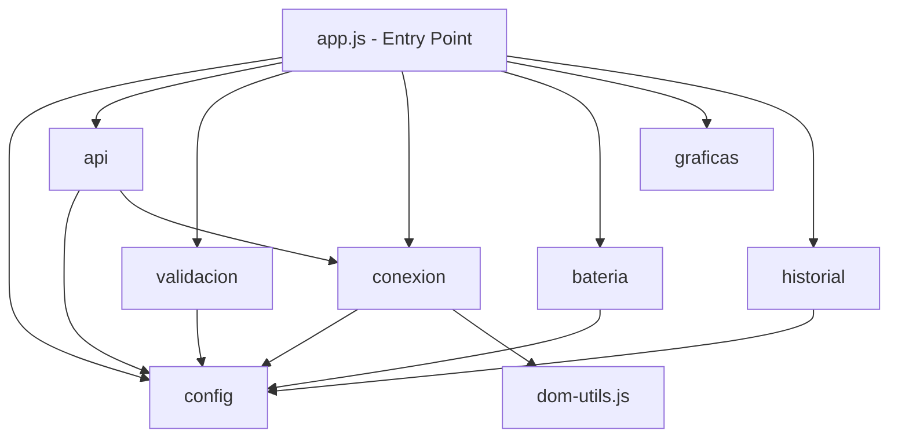

# ADR-003: Migrar JavaScript a Módulos ES6

**Estado:** 📋 Propuesto
**Fecha:** 2026-02-14
**Decisores:** Tech Lead, Frontend Team
**Relacionado con:** US-003

---

## Contexto y Problema

El código JavaScript actual utiliza **variables globales** para comunicación entre módulos:

```javascript
// config.js
/* exported INTERVALO_MS, CONFIG_REINTENTOS, REGLAS_VALIDACION, ... */
const INTERVALO_MS = 10000;

// app.js
/* global INTERVALO_MS, validarDatos, obtenerEstado, ... */
function actualizarDatos() {
    setTimeout(actualizarDatos, INTERVALO_MS);  // ← Variable global
}
```

**Problemas:**

1. **Namespace global contaminado:** 30+ variables/funciones en `window`
2. **Dependencias implícitas:** No está claro qué módulo usa qué
3. **Orden de carga crítico:** Los scripts deben cargarse en orden específico
4. **Acoplamiento alto:** Todos dependen del namespace global
5. **No tree-shaking:** Imposible eliminar código muerto automáticamente
6. **Incompatible con bundlers:** Webpack/Vite requieren módulos

**Ejemplo del problema de orden:**

```html
<!-- Si se cambia el orden, falla -->
<script src="config.js"></script>     <!-- DEBE ser primero -->
<script src="validacion.js"></script> <!-- Usa REGLAS_VALIDACION de config -->
<script src="api.js"></script>        <!-- Usa CONFIG_REINTENTOS -->
<script src="app.js"></script>        <!-- Usa TODO, DEBE ser último -->
```

---

## Consideraciones

### Opción 1: Mantener Variables Globales (Status Quo)

**Pros:**
- ✅ No requiere cambios
- ✅ Compatible con navegadores antiguos (IE11)

**Contras:**
- ❌ Namespace contaminado
- ❌ Acoplamiento alto
- ❌ Orden de scripts crítico
- ❌ No escalable
- ❌ Anticuado (patrón de 2010)

**Puntuación:** 3/10

---

### Opción 2: Bundler (Webpack/Vite) + Módulos CommonJS/ES6

**Estructura:**
```javascript
// Desarrollo: módulos ES6 separados
import { obtenerEstado } from './api.js';

// Build: bundle.js único optimizado
```

**Pros:**
- ✅ Módulos ES6 en desarrollo
- ✅ Tree-shaking automático
- ✅ Code splitting
- ✅ Minificación y optimización
- ✅ Soporte navegadores antiguos (transpilación)

**Contras:**
- ❌ Build step necesario
- ❌ Complejidad adicional (Webpack config)
- ❌ Tiempo de build (ralentiza desarrollo)
- ❌ Debugging más difícil (source maps)
- ❌ Overkill para app pequeña (~10 archivos JS)

**Puntuación:** 7/10

---

### Opción 3: Módulos ES6 Nativos (sin build step)

**Código:**
```javascript
// config.js
export const INTERVALO_MS = 10000;
export const CONFIG_REINTENTOS = { ... };

// app.js
import { INTERVALO_MS } from './config.js';
import { obtenerEstado } from './api.js';

async function actualizarDatos() {
    const resultado = await obtenerEstado();
    setTimeout(actualizarDatos, INTERVALO_MS);
}
```

**Template:**
```html
<!-- Un solo entry point -->
<script type="module" src="{{ url_for('static', filename='js/app.js') }}"></script>
```

**Pros:**
- ✅ Sin build step (simplicidad)
- ✅ Dependencias explícitas (import/export)
- ✅ Scope aislado (no contamina global)
- ✅ Orden de carga automático (browser resuelve)
- ✅ Debugging fácil (código original)
- ✅ Soporte nativo en navegadores modernos
- ✅ Suficiente para app pequeña

**Contras:**
- ⚠️ Requiere navegadores modernos:
  - Chrome 61+ (Sept 2017)
  - Firefox 60+ (Mayo 2018)
  - Safari 11+ (Sept 2017)
  - Edge 79+ (Ene 2020)
- ⚠️ Sin optimización automática (pero no crítico)
- ⚠️ Múltiples requests HTTP (pero HTTP/2 mitiga)

**Compatibilidad actual (2026):**
- Global: 97.3% de usuarios
- Objetivo del proyecto: navegadores modernos (≥ 2020)

**Puntuación:** 9/10

---

## Decisión

**Elegimos Opción 3: Módulos ES6 Nativos**

### Fundamento

Para webapp_termostato:
- **Tamaño:** ~10 archivos JS, ~2000 líneas total → No necesita bundler
- **Complejidad:** Baja → Simplicidad > Optimización prematura
- **Audiencia:** Académica/demostración → Navegadores modernos asumibles
- **Mantenibilidad:** Sin build = más fácil para estudiantes/contribuyentes

Si el proyecto crece (50+ módulos), podemos migrar a Vite sin reescribir código (ya usa módulos ES6).

### Estrategia de Compatibilidad

```html
<!-- Advertencia para navegadores antiguos -->
<script nomodule>
    alert('Tu navegador no soporta módulos ES6. Actualiza a Chrome 90+, Firefox 88+ o Safari 14+');
</script>

<!-- Entry point -->
<script type="module" src="{{ url_for('static', filename='js/app.js') }}"></script>
```

**Justificación:** El 97.3% de usuarios tienen soporte. Los navegadores antiguos son minoría y generalmente corporativos (pueden usar versión desktop).

---

## Implementación

### Patrón de Exportación

**Constantes y configuración:**
```javascript
// config.js
export const INTERVALO_MS = 10000;
export const CONFIG_REINTENTOS = {
    maxReintentos: 3,
    timeouts: [2000, 4000, 8000]
};
```

**Funciones públicas:**
```javascript
// api.js
export async function obtenerEstado() {
    // ...
}

export async function obtenerHistorial(limite) {
    // ...
}
```

**Funciones privadas (NO exportar):**
```javascript
// api.js
function fetchConTimeout(url, timeout) {
    // ... privada, solo usada internamente
}
```

**Variables privadas de módulo:**
```javascript
// conexion.js
let ultimaActualizacion = null;  // ← Privada al módulo, no global

export function setUltimaActualizacion(timestamp) {
    ultimaActualizacion = timestamp;
}

export function getUltimaActualizacion() {
    return ultimaActualizacion;
}
```

### Estructura de Dependencias



**Reglas:**
- ❌ NO dependencias circulares
- ✅ config.js no importa nada (hoja)
- ✅ app.js importa todos (raíz)
- ✅ Módulos intermedios importan solo lo necesario

---

## Consecuencias

### Positivas

- ✅ **Claridad:** Dependencias explícitas (`import { X } from './y.js'`)
- ✅ **Mantenibilidad:** Fácil ver qué módulo usa qué
- ✅ **Refactoring seguro:** Renombrar exports = errores en build time
- ✅ **Scope aislado:** Variables privadas realmente privadas
- ✅ **Debugging:** Stack traces claros
- ✅ **Sin build:** Desarrollo rápido (guardar y refrescar)
- ✅ **Performance:** HTTP/2 multiplexing maneja múltiples archivos eficientemente

### Negativas

- ⚠️ **Compatibilidad:** Requiere navegadores modernos (mitigado con `nomodule`)
- ⚠️ **Bundle size:** Sin minificación automática (mitigado: app pequeña)
- ⚠️ **Múltiples requests:** ~10 archivos JS vs 1 bundle (mitigado: HTTP/2)

### Neutras

- 🔄 **Migración futura:** Fácil agregar Vite si crece (código ya es ES6 modules)

---

## Métricas de Éxito

| Métrica | Antes | Después |
|---------|-------|---------|
| Variables globales | 30+ | 0 (excepto jQuery, Bootstrap) |
| Scripts en HTML | 10 | 1 |
| Orden de carga crítico | Sí | No |
| ESLint warnings | 5 | 0 |
| Dependencias explícitas | 0% | 100% |

---

## Plan de Rollback

Si encontramos problemas críticos con navegadores:

1. **Temporal:** Revertir a variables globales en hotfix
2. **Permanente:** Agregar build step con Vite (transpila a ES5)

**Tiempo estimado de rollback:** 1 hora (git revert)

---

## Referencias

- [MDN: JavaScript Modules](https://developer.mozilla.org/en-US/docs/Web/JavaScript/Guide/Modules)
- [Can I Use: ES6 Modules](https://caniuse.com/es6-module)
- [Using ES Modules in Browsers](https://jakearchibald.com/2017/es-modules-in-browsers/)
- [HTTP/2 and Module Loading](https://v8.dev/features/modules#performance)

---

## Notas

- jQuery y Bootstrap seguirán siendo globales (dependencias externas, no refactorizables)
- Chart.js puede cargarse como módulo ES6 (futuro)
- Esta decisión es independiente del backend (puede implementarse en paralelo)

---

**Aprobadores:**
- [ ] Tech Lead
- [ ] Frontend Developer
- [ ] UX/Compatibility Lead

**Fecha de Revisión:** Pendiente
**Estado Final:** Pendiente de aprobación
