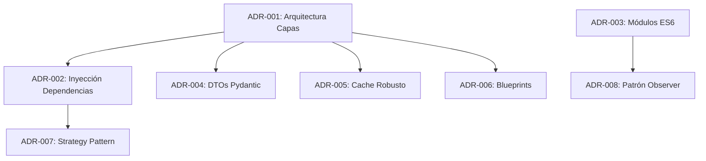

# Decisiones de Arquitectura (ADRs)

Esta carpeta contiene los **Architecture Decision Records (ADRs)** del proyecto webapp_termostato, documentando decisiones técnicas importantes siguiendo el formato [MADR](https://adr.github.io/madr/).

---

## 📋 Índice de ADRs

| ID | Título | Estado | Fecha | Prioridad |
|----|--------|--------|-------|-----------|
| [ADR-001](./ADR-001-arquitectura-capas.md) | Refactorizar Backend en Arquitectura por Capas | 📋 Propuesto | 2026-02-14 | P0 |
| [ADR-002](./ADR-002-inyeccion-dependencias.md) | Implementar Inyección de Dependencias | 📋 Propuesto | 2026-02-14 | P0 |
| [ADR-003](./ADR-003-modulos-es6.md) | Migrar JavaScript a Módulos ES6 | 📋 Propuesto | 2026-02-14 | P1 |
| ADR-004 | Reemplazar forms.py por DTOs Pydantic | 📋 Planificado | - | P0 |
| ADR-005 | Sistema de Caché Robusto | 📋 Planificado | - | P0 |
| ADR-006 | Implementar Blueprints Flask | 📋 Planificado | - | P2 |
| ADR-007 | Patrón Strategy para Validaciones | 📋 Planificado | - | P2 |
| ADR-008 | Patrón Observer para Actualizaciones UI | 📋 Planificado | - | P1 |

---

## 🔄 Estados de ADRs

- **📋 Propuesto:** Decisión documentada, pendiente de aprobación
- **✅ Aceptado:** Decisión aprobada por el equipo
- **🚧 Implementando:** En proceso de implementación
- **✔️ Implementado:** Completado y en producción
- **❌ Rechazado:** Decisión descartada (con justificación)
- **⚠️ Obsoleto:** Reemplazado por otro ADR (con referencia)

---

## 📐 Formato de ADR

Cada ADR sigue la estructura:

1. **Metadatos**
   - Estado
   - Fecha
   - Decisores
   - Relaciones (depende de, bloquea a)

2. **Contexto y Problema**
   - Situación actual
   - Problema a resolver
   - Código problemático (ejemplos)

3. **Consideraciones**
   - Opción 1, 2, 3... (con pros/contras)
   - Puntuación de cada opción

4. **Decisión**
   - Opción elegida
   - Fundamento detallado
   - Principios aplicados

5. **Consecuencias**
   - Positivas
   - Negativas
   - Neutras
   - Riesgos

6. **Implementación** (opcional)
   - Plan técnico
   - Ejemplos de código

7. **Validación**
   - Criterios de aceptación
   - Métricas esperadas

8. **Referencias**
   - Enlaces externos
   - Documentación relacionada

---

## 🔗 Dependencias entre ADRs



---

## 📝 Cómo Crear un Nuevo ADR

1. **Copiar template:**
   ```bash
   cp ADR-TEMPLATE.md ADR-009-nuevo-titulo.md
   ```

2. **Completar campos:**
   - Estado inicial: 📋 Propuesto
   - Fecha de creación
   - Decisores (roles)
   - Relaciones con otros ADRs

3. **Documentar opciones:**
   - Mínimo 2 opciones (incluyendo status quo)
   - Pros/contras de cada una
   - Puntuación objetiva (1-10)

4. **Justificar decisión:**
   - Por qué esta opción
   - Qué principios se aplican
   - Qué trade-offs se aceptan

5. **Solicitar revisión:**
   - Tech Lead (obligatorio)
   - Desarrolladores afectados
   - Arquitecto (si aplica)

6. **Actualizar índice:**
   - Agregar fila en tabla de este README
   - Actualizar diagrama de dependencias si aplica

---

## ✅ Proceso de Aprobación

1. **Propuesta:** Desarrollador crea ADR con estado 📋 Propuesto
2. **Revisión:** Tech Lead y equipo revisan (max 3 días)
3. **Discusión:** Reunión si hay desacuerdo (opcional)
4. **Decisión:**
   - ✅ Aceptado → Puede implementarse
   - ❌ Rechazado → Documentar razón en el ADR
   - 🔄 Revisar → Solicitar cambios
5. **Implementación:** Cambiar estado a 🚧 Implementando
6. **Completado:** Cambiar estado a ✔️ Implementado + fecha

---

## 🔍 ADRs Relacionados con Historias de Usuario

| ADR | Historia de Usuario | Sprint |
|-----|---------------------|--------|
| ADR-001 | [US-001](../historias_usuario/US-001-refactor-backend-capas.md) | 1 |
| ADR-002 | [US-002](../historias_usuario/US-002-inyeccion-dependencias.md) | 1-2 |
| ADR-003 | [US-003](../historias_usuario/US-003-migracion-es6-modules.md) | 3 |

---

## 📚 Referencias

- [Architecture Decision Records (ADR)](https://adr.github.io/)
- [MADR Template](https://adr.github.io/madr/)
- [Why Write ADRs](https://github.blog/2020-08-13-why-write-adrs/)
- [ADR Tools](https://github.com/npryce/adr-tools)

---

**Última Actualización:** 2026-02-14
**Mantenedor:** Tech Lead
