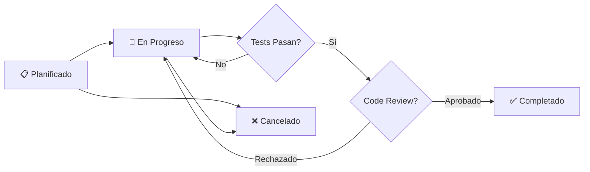

# Historias de Usuario - Mejoras Técnicas

Esta carpeta contiene las **Historias de Usuario técnicas** para las mejoras de arquitectura y calidad del proyecto webapp_termostato.

---

## 📋 Backlog de Historias

### 🔴 FASE 1: Fundamentos Backend (Sprint 1-2)

| ID | Título | Story Points | Prioridad | Estado | ADR Relacionado |
|----|--------|--------------|-----------|--------|-----------------|
| [US-001](./US-001-refactor-backend-capas.md) | Refactorizar Backend en Arquitectura por Capas | 13 | P0 | 📋 Planificado | ADR-001 |
| [US-002](./US-002-inyeccion-dependencias.md) | Implementar Inyección de Dependencias | 8 | P0 | 📋 Planificado | ADR-002 |
| US-004 | Reemplazar forms.py por DTOs Pydantic | 5 | P0 | 📋 Planificado | ADR-004 |
| US-005 | Sistema de Caché Robusto (thread-safe) | 8 | P0 | 📋 Planificado | ADR-005 |

**Total Fase 1:** 34 Story Points (~2 sprints)

---

### 🟡 FASE 2: Modernización Frontend (Sprint 3-4)

| ID | Título | Story Points | Prioridad | Estado | ADR Relacionado |
|----|--------|--------------|-----------|--------|-----------------|
| [US-003](./US-003-migracion-es6-modules.md) | Migrar JavaScript a Módulos ES6 | 8 | P1 | 📋 Planificado | ADR-003 |
| US-006 | Dividir conexion.js en Módulos Cohesivos | 5 | P1 | 📋 Planificado | - |
| US-008 | Implementar Patrón Observer para UI | 8 | P1 | 📋 Planificado | ADR-008 |

**Total Fase 2:** 21 Story Points (~1.5 sprints)

---

### 🟢 FASE 3: Extensibilidad (Sprint 5)

| ID | Título | Story Points | Prioridad | Estado | ADR Relacionado |
|----|--------|--------------|-----------|--------|-----------------|
| US-007 | Implementar Blueprints en Flask | 5 | P2 | 📋 Planificado | ADR-006 |
| - | Patrón Strategy para Validaciones | 5 | P2 | 📋 Planificado | ADR-007 |
| - | Logging Estructurado | 3 | P2 | 📋 Planificado | - |
| - | Type Hints Completos | 3 | P2 | 📋 Planificado | - |
| - | Manejo de Errores Centralizado | 2 | P2 | 📋 Planificado | - |

**Total Fase 3:** 18 Story Points (~1 sprint)

---

## 📊 Métricas de Progreso

### Por Estado

| Estado | Cantidad | Story Points |
|--------|----------|--------------|
| 📋 Planificado | 13 | 84 |
| 🔄 En Progreso | 0 | 0 |
| ✅ Completado | 0 | 0 |
| ❌ Cancelado | 0 | 0 |
| **TOTAL** | **13** | **84** |

### Por Prioridad

| Prioridad | Cantidad | Story Points |
|-----------|----------|--------------|
| P0 - Crítico | 4 | 34 |
| P1 - Alto | 3 | 21 |
| P2 - Medio | 5 | 18 |
| P3 - Bajo | 1 | 11 |

### Por Área

| Área | Cantidad | Story Points |
|------|----------|--------------|
| Backend | 6 | 45 |
| Frontend | 4 | 26 |
| Infraestructura | 3 | 13 |

---

## 🎯 Criterios de Priorización

### P0 - Crítico
- Bloquea otras historias
- Mejora arquitectónica fundamental
- Afecta testabilidad o mantenibilidad crítica
- **Ejemplos:** US-001, US-002, US-004, US-005

### P1 - Alto
- Mejora significativa de calidad
- Reduce deuda técnica importante
- Facilita desarrollo futuro
- **Ejemplos:** US-003, US-006, US-008

### P2 - Medio
- Mejora incremental
- Buenas prácticas
- Nice to have
- **Ejemplos:** US-007, Logging, Type Hints

### P3 - Bajo
- Optimizaciones menores
- Refactoring cosmético
- Documentación adicional

---

## 📝 Formato de Historia de Usuario

Cada US contiene:

### 1. Metadatos
- Epic
- Prioridad (P0-P3)
- Story Points (Fibonacci)
- Sprint asignado
- Estado actual

### 2. Historia
```
Como [rol]
Quiero [funcionalidad/mejora]
Para [beneficio/valor]
```

### 3. Contexto Técnico
- Problema actual (código existente)
- Solución propuesta (código objetivo)
- Métricas de mejora

### 4. Criterios de Aceptación
- ✅ Funcionales
- ✅ No funcionales
- ✅ Testing
- ✅ Calidad

### 5. Tareas Técnicas
- Checklist detallado
- Estimación por tarea
- Archivos a modificar

### 6. Estimación
- Tabla de tareas con horas
- Story Points justificados

### 7. Definición de Hecho (DoD)
- Checklist universal de calidad
- Métricas a cumplir
- Aprobaciones necesarias

### 8. Riesgos
- Tabla de riesgos con mitigaciones

### 9. Dependencias
- Bloquea a...
- Depende de...

---

## 🔄 Workflow de Historia



### Estados

- **📋 Planificado:** Historia creada y documentada
- **🔄 En Progreso:** Desarrollador asignado, trabajando
- **✅ Completado:** Cumple DoD, mergeado a develop
- **❌ Cancelado:** No se implementará (con justificación)

### Transiciones

1. **Planificado → En Progreso:**
   - Asignar desarrollador
   - Crear branch `feature/US-XXX-descripcion`
   - Cambiar estado en US

2. **En Progreso → Completado:**
   - ✅ Todos los criterios de aceptación cumplidos
   - ✅ Tests al 100% (sin regresiones)
   - ✅ Code review aprobado
   - ✅ Quality checks pasan
   - ✅ Documentación actualizada
   - ✅ Merge a develop

3. **Cualquier Estado → Cancelado:**
   - Documentar razón de cancelación
   - Actualizar dependencias

---

## 🔗 Relación con ADRs

Cada Historia de Usuario implementa una o más decisiones de arquitectura (ADRs):

| Historia | ADR(s) Implementado(s) |
|----------|------------------------|
| US-001 | ADR-001 (Arquitectura Capas) |
| US-002 | ADR-002 (Inyección Dependencias) |
| US-003 | ADR-003 (Módulos ES6) |
| US-004 | ADR-004 (DTOs Pydantic) |
| US-005 | ADR-005 (Cache Robusto) |
| US-007 | ADR-006 (Blueprints) |
| US-008 | ADR-008 (Patrón Observer) |

**Proceso:**
1. ADR documenta la decisión técnica (qué y por qué)
2. US describe la implementación (cómo y cuándo)

---

## 📈 Velocity Tracking

**Velocity Objetivo:** 15-20 SP/sprint

| Sprint | Story Points Planeados | Completados | Velocity |
|--------|------------------------|-------------|----------|
| 1 | - | - | - |
| 2 | - | - | - |
| 3 | - | - | - |
| 4 | - | - | - |
| 5 | - | - | - |
| 6 | - | - | - |

**Actualizar después de cada sprint.**

---

## ✅ Definition of Done (Universal)

Todas las historias deben cumplir:

- [ ] Código revisado por ≥1 desarrollador senior
- [ ] Tests unitarios y de integración al 100%
- [ ] Cobertura de código sin regresiones
- [ ] Pylint/ESLint sin errores
- [ ] mypy sin errores (backend)
- [ ] Documentación actualizada
- [ ] ADR relacionado marcado como implementado (si aplica)
- [ ] Desplegado en staging
- [ ] Pruebas manuales exitosas
- [ ] Sin deuda técnica introducida

---

## 🚀 Cómo Trabajar una Historia

### 1. Preparación
```bash
# Asegurarse de estar en develop actualizado
git checkout develop
git pull origin develop

# Crear branch para la historia
git checkout -b feature/US-XXX-descripcion
```

### 2. Desarrollo
- Leer ADR relacionado (si existe)
- Seguir checklist de Tareas Técnicas
- Aplicar TDD (tests primero, luego implementación)
- Commitear frecuentemente con mensajes descriptivos

### 3. Validación
```bash
# Tests
pytest --cov=webapp --cov-report=html

# Quality checks
/quality-check webapp/

# Linting
pylint webapp/
mypy webapp/
```

### 4. Code Review
- Crear Pull Request a develop
- Referenciar historia: "Implementa US-XXX"
- Solicitar review de ≥1 desarrollador
- Aplicar feedback

### 5. Merge
- Squash commits (opcional)
- Merge a develop
- Borrar branch feature
- Cambiar estado US a ✅ Completado
- Actualizar métricas en README principal

---

## 📚 Referencias

- [User Story Template](https://www.mountaingoatsoftware.com/agile/user-stories)
- [INVEST Criteria](https://en.wikipedia.org/wiki/INVEST_(mnemonic))
- [Definition of Done](https://www.scrum.org/resources/blog/done-understanding-definition-done)

---

**Última Actualización:** 2026-02-14
**Product Owner:** -
**Scrum Master:** -
